# Sporty Shoes Shopping Screenshots

This is the screenshots for the Sporty Shoes Shopping project. The project is a web application that
allows users to browse and purchase shoes. The application is built using the Spring Boot framework
and the Thymeleaf templating engine, with a Bootstrap front-end.

Writeup of the application is in a separate file.

# User Registration and Login

When the application is first run and opened, the user is greeted with the login page. If the user
does not have an account, they can click on the "Register" link to create an account. If no user has
been created, a banner is shown asking the user to create the admin user for the site.

The user cannot access any other pages until they have logged in.

The login page is shown below.

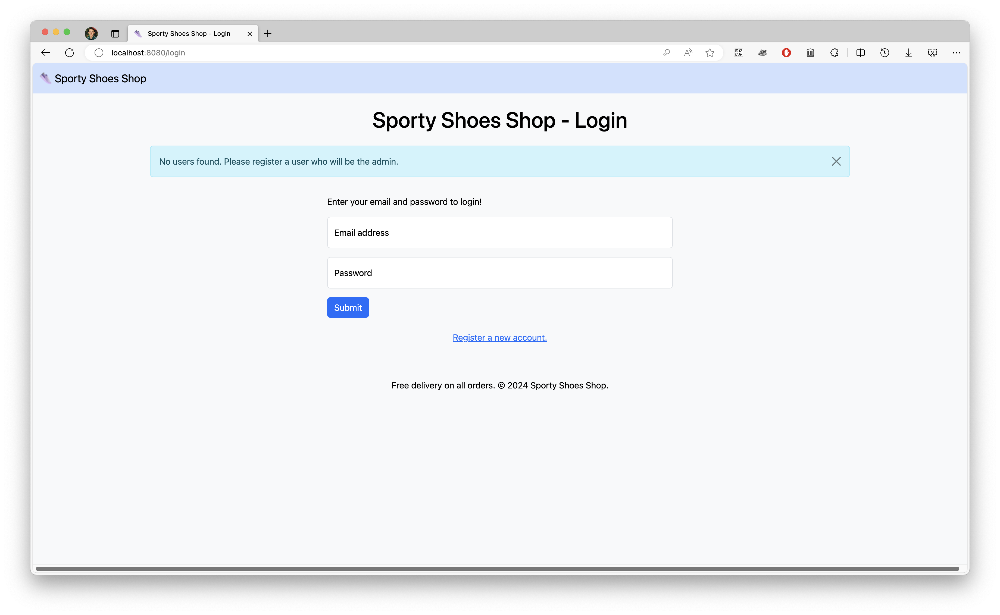

The registration page is shown below.

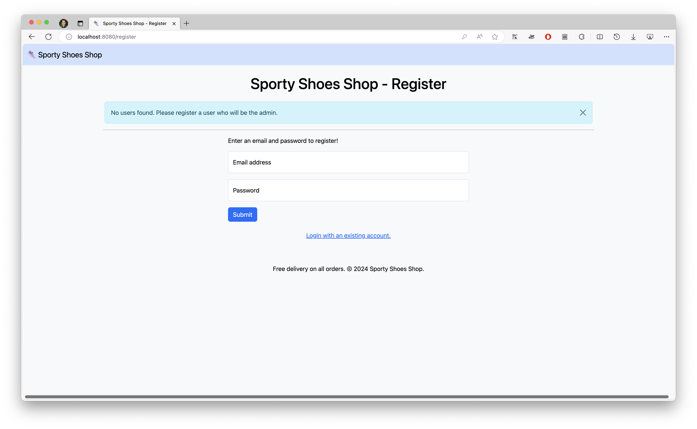

Once a user has been registered, the user can log in with their email address and password. The web
browser detects the login form, and fills in the email address and password automatically.

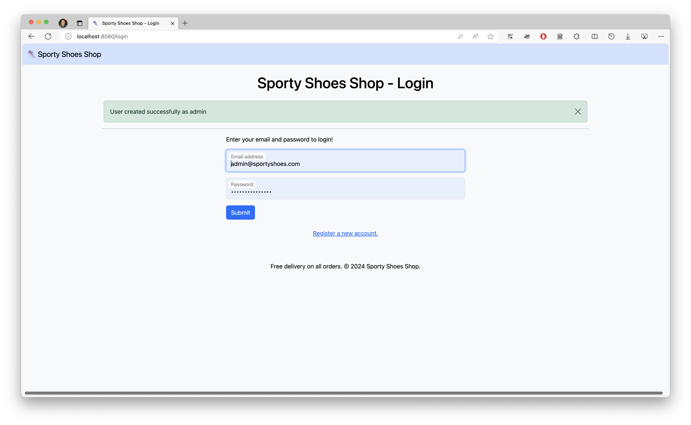

Once the admin user has logged in, they are taken to the admin products page. 

# Admin Dashboard

All admin pages at the `/admin/*` address have a yellow navigation bar and are only accessible to
the admin user.

## Product Management

The product management page is shown below. There are no products because the
admin user has just been created.

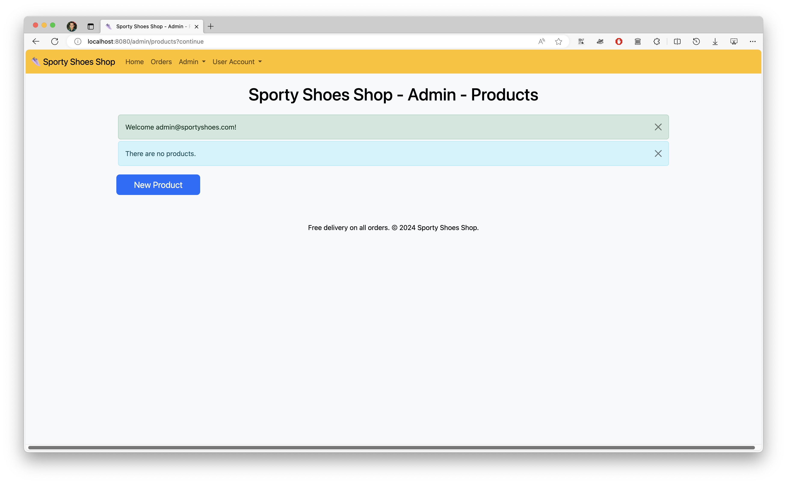

The admin user can access other admin pages using the dropdown menu in the navigation bar.

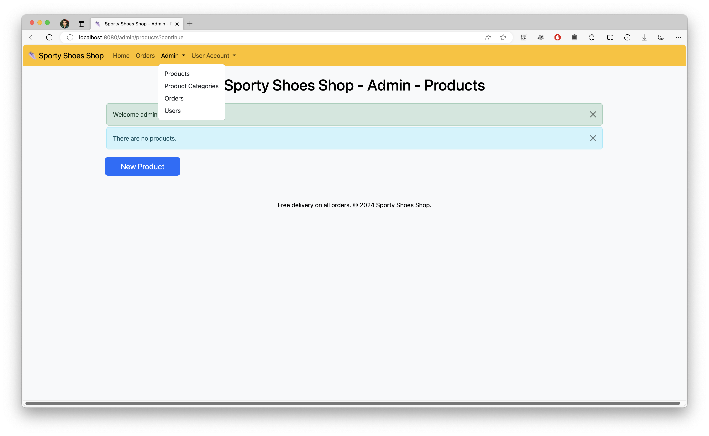

Before creating products for the site, the admin user will create categories for the products.

### Product Categories

The product categories management page is shown below. It is empty because no categories have been
created yet. The admin user can create categories by clicking on the `New Product Category` button.

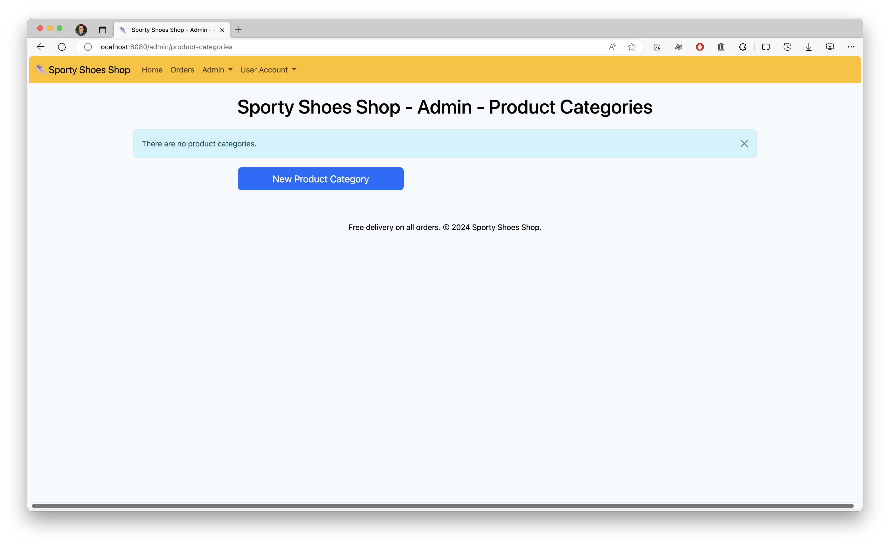

The admin user can create a new category by entering the category name and clicking the `Save`
button.

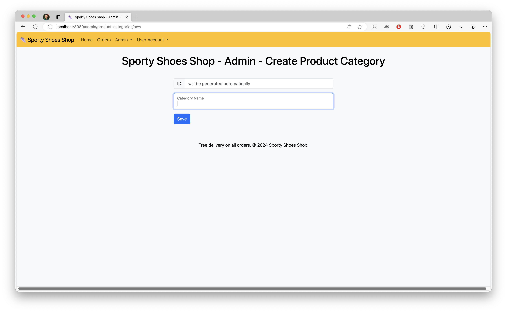

The admin user can then see the new category in the categories list, including how many products
each category has. They can also search for categories using the search box, and the table will
update to only show matching categories as they type.

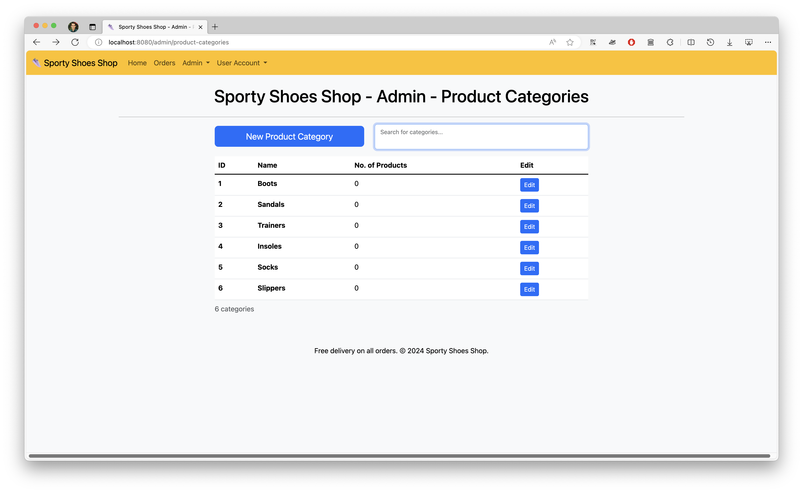

The admin user can also edit the category by clicking the `Edit` button.

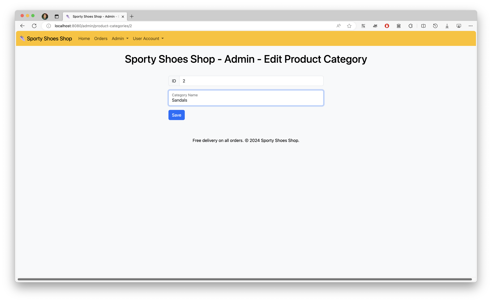

### Products

On the products page, the admin user can create new products by clicking the `New Product` button.
The user is prompted to add a name, description, category, price, and number in stock.

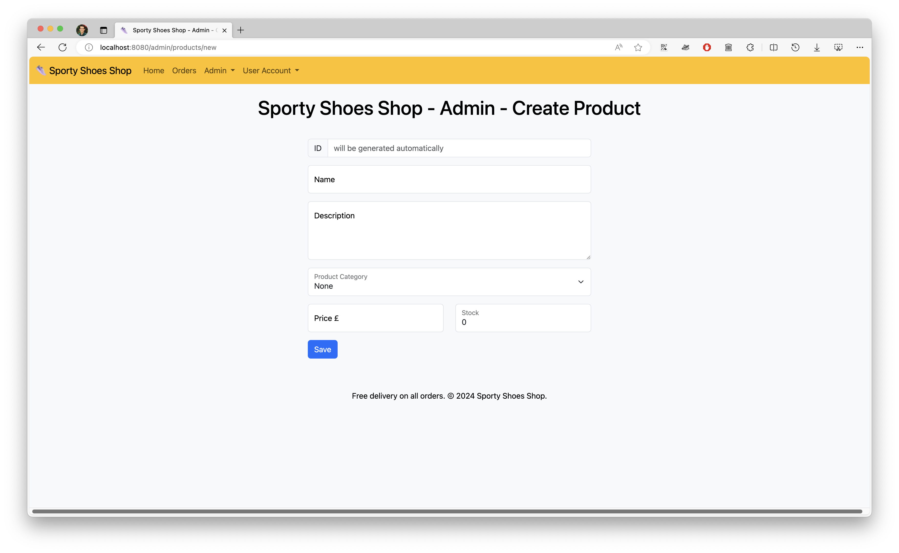

The admin user can see the new product in the products list, and filter them by category. They can
also search for products using the search box, and the table will update to only show matching
products as they type.

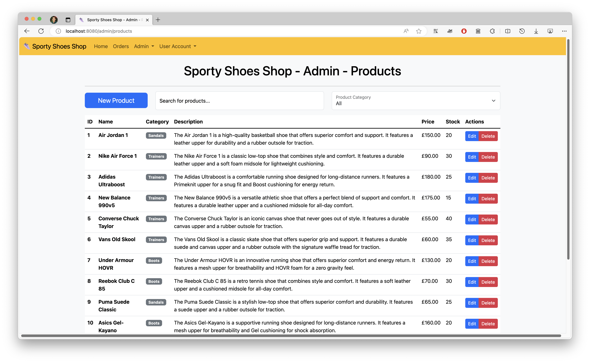

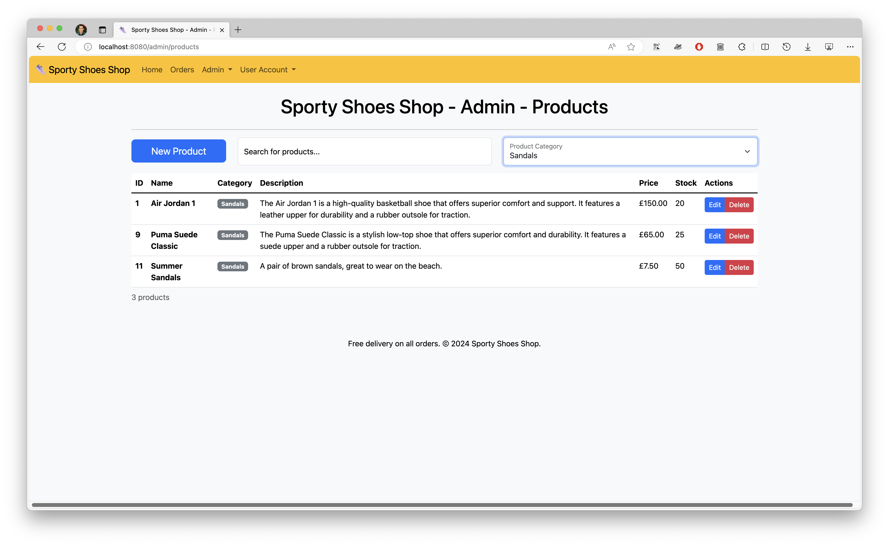

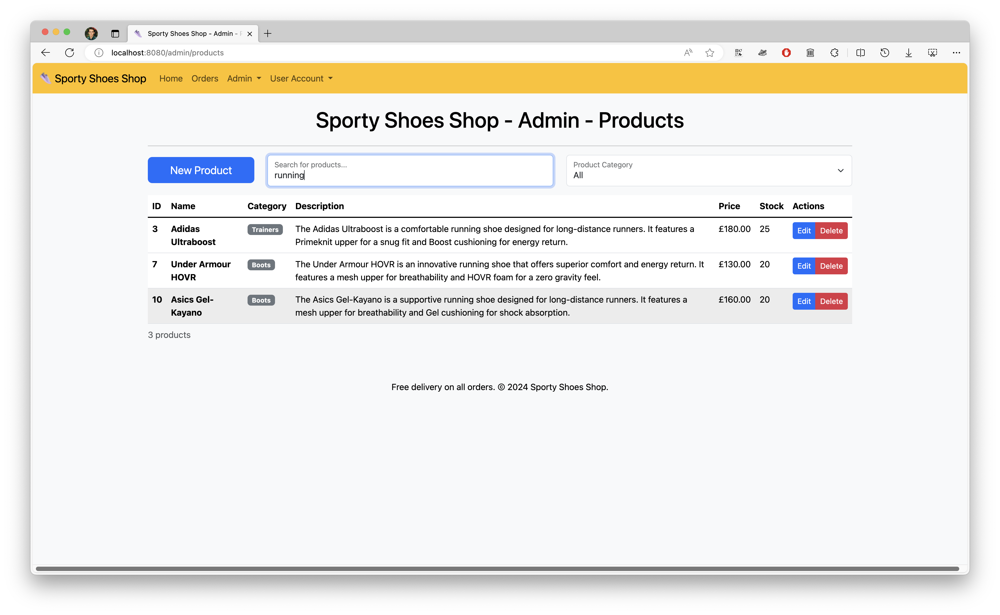

The admin user can delete the product by clicking the `Delete` button, and it will be removed
immediately. The product is marked as 'deleted' but not deleted from the database, so that users can
still see the product in their order history.

The admin user can also edit the product by clicking the `Edit` button. When the product is edited,
the old product is marked as 'deleted' and a new one is created in its place with the new details.
This allows users to see the product in their order history with the correct details.

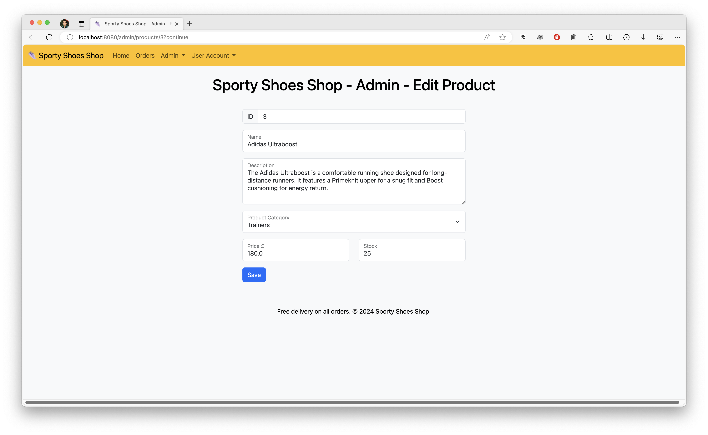

Data validation exists to ensure that the stock and the price do not fall below 0. If the admin user
tries to save the product with invalid data, an error message is shown.

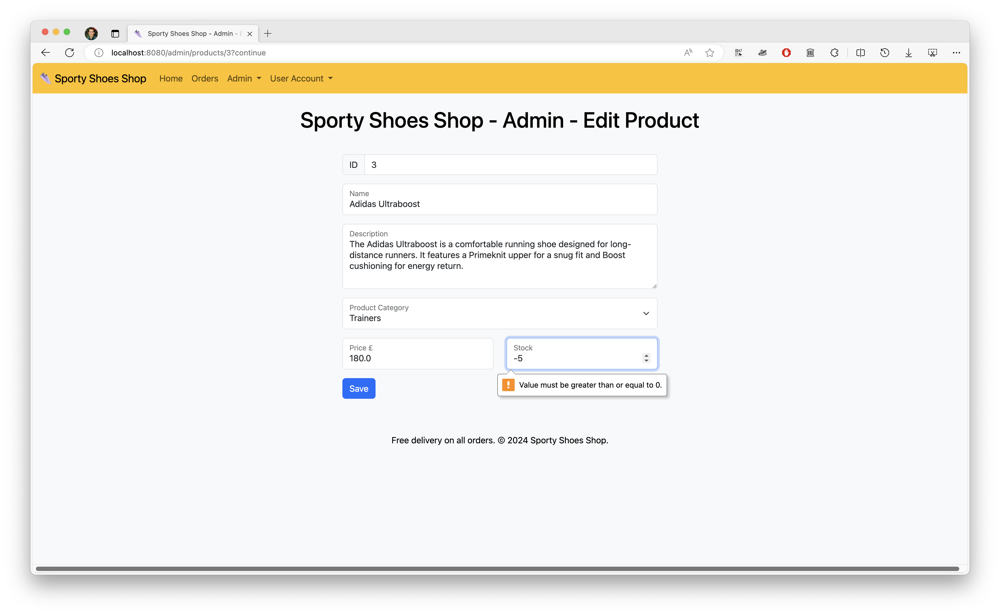 
