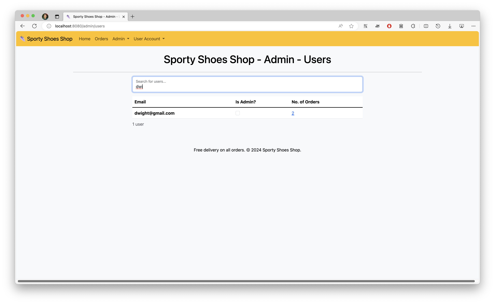
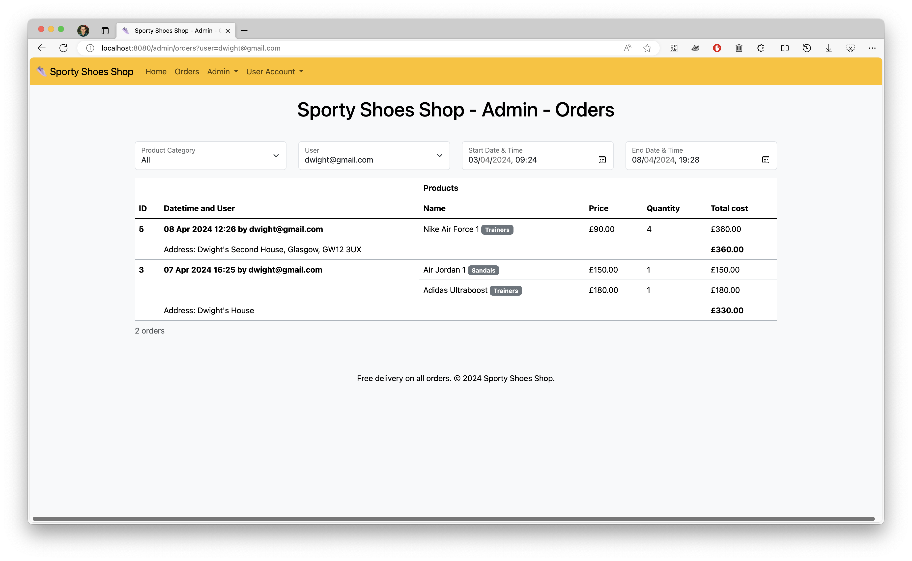

# Sporty Shoes Shopping Screenshots

*By Christopher Menon*

This is the screenshots for the Sporty Shoes Shopping project. The project is a web application that
allows users to browse and purchase shoes. The application is built using the Spring Boot framework
and the Thymeleaf templating engine, with a Bootstrap front-end.

Writeup of the application is in a separate file.

<!-- TOC -->
* [Sporty Shoes Shopping Screenshots](#sporty-shoes-shopping-screenshots)
    * [User Registration and Login](#user-registration-and-login)
    * [Admin Dashboard](#admin-dashboard)
        * [Product Management](#product-management)
            * [Product Categories](#product-categories)
            * [Products](#products)
    * [User Shopping](#user-shopping)
    * [User Account Management](#user-account-management)
    * [Admin Dashboard (continued)](#admin-dashboard-continued)
        * [Orders (purchase reports)](#orders-purchase-reports)
        * [User Management](#user-management)
<!-- TOC -->

## User Registration and Login

When the application is first run and opened, the user is greeted with the login page. If the user
does not have an account, they can click on the "Register" link to create an account. If no user has
been created, a banner is shown asking the user to create the admin user for the site.

The user cannot access any other pages until they have logged in.

The login page is shown below.

The registration page is shown below.

Once a user has been registered, the user can log in with their email address and password. The web
browser detects the login form, and fills in the email address and password automatically.

Once the admin user has logged in, they are taken to the admin products page. 

## Admin Dashboard

All admin pages at the `/admin/*` address have a yellow navigation bar and are only accessible to
the admin user.

### Product Management

The admin products page is shown below. There are no products because the
admin user has just been created.

The admin user can access other admin pages using the dropdown menu in the navigation bar.

Before creating products for the site, the admin user will create categories for the products.

#### Product Categories

The admin product categories page is shown below. It is empty because no categories have been
created yet. The admin user can create categories by clicking on the `New Product Category` button.

The admin user can create a new category by entering the category name and clicking the `Save`
button.

The admin user can then see the new category in the categories list, including how many products
each category has. They can also search for categories using the search box, and the table will
update to only show matching categories as they type.

The admin user can also edit a category by clicking the `Edit` button.

#### Products

On the admin products page, the admin user can create new products by clicking the `New Product`
button.
The user is prompted to add a name, description, category, price, and number in stock.

The admin user can see the new product in the products list, and filter them by category. They can
also search for products using the search box, and the table will update to only show matching
products as they type.

The admin user can delete the product by clicking the `Delete` button, and it will be removed
immediately with confirmation to the user. The product is marked as 'deleted' but not deleted from
the database, so that users can
still see the product in their order history.

The admin user can also edit the product by clicking the `Edit` button. When the product is edited,
the old product is marked as 'deleted' and a new one is created in its place with the new details.
This allows users to see the product in their order history with the correct details.

Data validation exists to ensure that the stock and the price do not fall below 0. If the admin user
tries to save the product with invalid data, an error message is shown.

 

Further elements of the admin dashboard [are shown below](#admin-dashboard-continued).

## User Shopping

We will now register a standard (non-admin) user and login. All users created after the first user
are standard users with no access to the admin pages.

When a standard user logs in, they are taken to the products page. The user can see all the products
that the admin user has created. The user can choose products by entering a quantity, and the
product will be highlighted green. The user cannot order products that are out of stock, and cannot
order more products than are in stock.

Once the user has selected their products, they enter a delivery address and click the `Order`
button to create an order.

The user can filter products by category, and search for products using the search box. The table
will update to only show matching products as they type. Products that they have added a quantity to
but are not shown in the filter are greyed out, but still visible as they will be ordered.

The user can view their orders by clicking on the `Orders` option in the navigation bar. Each order
shows the date, time, address, products purchased, and the total cost.

The user can filter their orders by product category, or by order date & time. The table of orders
is updated immediately as soon as the user selects a filter. The user cannot select a date & time
before the first order, and after the last order.

## User Account Management

All users (admin and standard) can access the change password page via the `User Account` dropdown
menu. This page prompts for the user's existing password and new password, which are checked before
the password is updated.

The user can also log out from the dropdown menu.

## Admin Dashboard (continued)

Further elements of the admin dashboard [are shown above](#admin-dashboard).

### Orders (purchase reports)

The admin user can view all the purchase reports by clicking on the `Admin -> Orders` option in the
navigation bar. Each order
shows the date, time, user, address, products purchased, and the total cost.

The admin user can filter the orders by category, user, or by date & time. The table of orders
is updated immediately as soon as the user selects a filter. The user cannot select a date & time
before the first order, and after the last order.

### User Management

The user management page is shown below. As well as the admin user, there are also three other
users. All users created after the first user are standard users with no access to the admin pages.

The admin user can search for users using the search box, and the table will update to only show
matching users as they type.

The admin user can see the users' email addresses and the number of orders they have placed. They
can click on the blue number of orders to see the user's order history on the admin Orders page.
This is done using query parameters in the URL.

