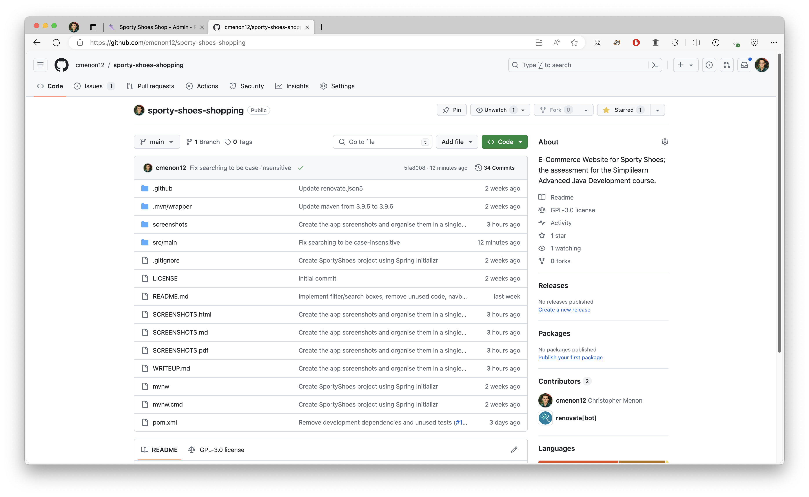
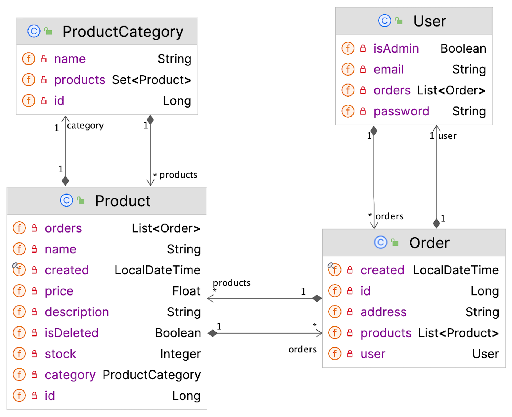

# Sporty Shoes Shopping Writeup

*By Christopher Menon*

This is the writeup for the Sporty Shoes Shopping project. The project is a web application that
allows users to browse and purchase shoes. The application is built using the Spring Boot framework
and the Thymeleaf templating engine, with a Bootstrap front-end.

Screenshots of the application are in a separate file.

## How to Use

All the source code can be found on GitHub
at [https://github.com/cmenon12/sporty-shoes-shopping](https://github.com/cmenon12/sporty-shoes-shopping).

[](https://github.com/cmenon12/sporty-shoes-shopping)

This application runs on Java 17 and Maven.

The MySQL database is required to run this application. The database configuration can be found in
the `src/main/resources/application.properties` file. The default database configuration is:

```properties
spring.datasource.driver-class-name=com.mysql.cj.jdbc.Driver
spring.datasource.url=jdbc:mysql://localhost:3306/SportyShoes
spring.datasource.username=root
spring.datasource.password=root
```

The database `SportyShoes` is created when the application is first run.

## Project Structure

The project is structured as follows:

- All Java source code is in the `com.sportyshoes` package, with several sub-packages.
    - The main application class
      is `SportyShoesApplication.java`, which is the entry point for the application.
    - The entities are in the `entity` package.
  These are the objects that are stored in the database.
    - The repositories are in the `repository`
  package. These are the classes that interact with the database.
    - The services are in the `service` package.
  These are the classes that handle the business logic of the application.
    - The controllers are in the `controller`
  package. The `ShoppingController` handles the shopping web requests, and the `UserController`
  handles the
  user web requests. There are also three admin controllers.
    - The `config` package contains the security and web
  configuration.
- In the `resources` folder, the `application.properties` file contains
  the database configuration, and the `templates` folder contains the HTML templates for the
  application. The `static` folder contains some JavaScript and the logo.

A tree diagram of the project structure is below.

```
.
└── main
    ├── java
    │   └── com
    │       └── sportyshoes
    │           ├── SportyShoes
    │           │   └── SportyShoesApplication.java
    │           ├── config
    │           │   ├── MySecurityConfig.java
    │           │   ├── MySuccessHandler.java
    │           │   ├── MyWebConfig.java
    │           │   └── TrailingSlashRedirectFilter.java
    │           ├── controller
    │           │   ├── AdminController.java
    │           │   ├── AdminProductCategoryController.java
    │           │   ├── AdminProductController.java
    │           │   ├── ShoppingController.java
    │           │   └── UserController.java
    │           ├── entity
    │           │   ├── Order.java
    │           │   ├── Product.java
    │           │   ├── ProductCategory.java
    │           │   └── User.java
    │           ├── repository
    │           │   ├── OrderRepository.java
    │           │   ├── ProductCategoryRepository.java
    │           │   ├── ProductRepository.java
    │           │   └── UserRepository.java
    │           └── service
    │               ├── OrderService.java
    │               ├── PasswordEncoderService.java
    │               ├── ProductCategoryService.java
    │               ├── ProductService.java
    │               └── UserService.java
    └── resources
        ├── application.properties
        ├── static
        │   ├── favicon.ico
        │   ├── filters.js
        │   ├── logo.png
        │   └── logo_navbar.png
        └── templates
            ├── admin_product_categories.html
            ├── admin_product_categories_edit.html
            ├── admin_products.html
            ├── admin_products_edit.html
            ├── admin_users.html
            ├── change_password.html
            ├── fragments
            │   └── base.html
            ├── login.html
            ├── orders.html
            ├── register.html
            └── shop.html
```

### Object Entities

The application has four entities: `User`, `Product`, `ProductCategory`, and `Order`. The diagram
below shows the entities, their attributes, and their relationships.



The three entity relationships are:

- One `User` can have many `Order`s, and one `Order` can have one `User` (one-to-many).
- One `ProductCategory` can have many `Product`s, and one `Product` can have one `ProductCategory` (
  one-to-many).
- One `Product` can be in many `Order`s, and one `Order` can have many `Product`s (many-to-many).

### Website Structure

The website has the following pages:

- Registration page to create a user.
- Login page to log in a user.
- Shopping page to view products and create an order.
- User dashboard to view orders.
- Change password page to change the user's password.

Four admin pages exist to:

- Manage products.
- Manage product categories.
- View all orders.
- View all users.

## Product Capabilities

End-user capabilities include:

- User registration, login, and logout using an email address and password.
- Viewing the products in the store, including filtering them by category and searching them.
- Creating an order of one or more products with an address.
- Viewing the user's own orders.
- Changing the user's password.

Admin capabilities include:

- Viewing the products in the store, including filtering them by category and searching them.
- Managing the products in the store (creating, editing, deleting) including categorising them.
- Viewing the product categories in the store, including searching them and listing how many
  products each category has.
- Managing the product categories in the store (creating and editing).
- Viewing all purchase reports (orders) in the store, including filtering them by user, category,
  and date & time.
- Viewing all users who have signed up, including searching them and listing how many orders each
  user has.

Application security capabilities include:

- Only the admin user can access the admin pages.
- The user must log in to access the shopping pages.
- Passwords are encoded using the BCrypt strong hashing function.
- The user must enter their existing password to change their password.
- CSRF protection is enabled on all forms to prevent cross-site request forgery attacks.
- The latest versions of Spring Boot and Spring Security are used.

## Development History

The project was created using JetBrains IntelliJ IDE. The full development history can be found in
the [commit history of the GitHub repository](https://github.com/cmenon12/sporty-shoes-shopping/commits/main/).

1. I first created the Java Maven project using the Spring Initializr, and opened it in IntelliJ
   IDE.
2. I created the four entity classes, along with their respective repository and service classes.
3. I then created the controllers and HTML templates for the user signup, login, and logout. I added
   the Bootstrap CSS and JavaScript to the project for styling.
4. I then created the shopping controllers and HTML page, and controllers for creating an order.
5. I then created the admin dashboard to view products and orders, and the user dashboard to view
   their own orders. I used the same HTML template for the two orders dashboards.
6. Next I implemented the Product Categories functionality, including on the user and admin pages.
7. I then added the Spring Security starter to the project, and migrated from managing user sessions
   manually to using Spring Security for user authentication.
8. I then added the ability for users to change their password, and an admin page to view all users.
9. I then added the search boxes and filters when looking at products, product categories, users,
   and orders, and improved the look and feel of the application.
10. Finally, I tested that the application fully met the requirements, removed the development
    dependencies, and applied several small fixes whilst creating the writeup and screenshots.
